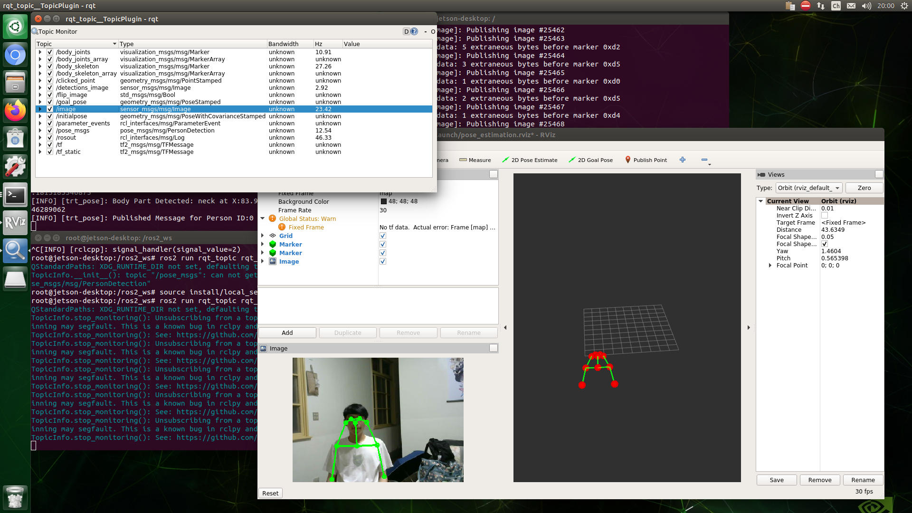

# ros2_trt_pose_nano_jp44
Original Repository: https://github.com/NVIDIA-AI-IOT/ros2_trt_pose

This dockerfile had been test under Jeston Nano, Jetpack4.4.

All dependencies will be installed during the docker building.

Whole building process will take about 1.5 hour.

Make sure your power mode is MAXN (10W, High Performance) and use DC power supply (5V 4A).

- Change to MAXN Mode

```
$ sudo nvpmodel -m 0
```

# Package output
- Pose message
- Pose detection image message
- Visualization markers
- Launch file for RViz



## Build Image

- Clone this repository

```
$ git clone https://github.com/xerathyang/ros2_trt_pose_nano_jp44.git
$ cd ros2_trt_pose_nano_jp44
```

- Build Docker

```
$ sudo sh docker_build.sh
```

## Run Container

- Run container

```
$ sudo sh docker_run.sh
```

- Use Another Terminal to connect to container
  
  *Note: You will need total 4 terminals to run all nodes.*

```
$ sudo docker exec -it <container_name> bash
```

## Build & Install ros2_trt_pose Package

- Check requirements

```
$ cd /ros2_ws
$ rosdep install --from-paths src --ignore-src --rosdistro eloquent -y
```

- Build and install ros2_trt_pose package

```
$ colcon build
$ source install/local_setup.sh
```

## Important  *FOR SSH USER* : Forwarding Graphic Through

If you encounter some error while using ssh connect, these command maybe required for GUI showing.

- MoTTY X11 proxy: Unsupported authorisation protocol

```
$ export DISPLAY='<Your host IP>:0.0'
```

- libGL error: MESA-LOADER: failed to open swrast (search paths /usr/lib/aarch64-linux-gnu/dri:\$${ORIGIN}/dri:/usr/lib/dri)
libGL error: failed to load driver: swrast

```
$ apt install --reinstall libgl1-mesa-dri
$ ln -sf /usr/lib/aarch64-linux-gnu/libdrm.so.2.4.0 /usr/lib/aarch64-linux-gnu/libdrm.so.2
```

Solution From:
https://forums.developer.nvidia.com/t/swrast-again/155668
https://www.thegeekstuff.com/2010/06/xhost-cannot-open-display/

## Run ros2_trt_pose

- Run ```ros2_trt_pose``` node

```
$ ros2 run ros2_trt_pose pose-estimation --ros-args -p base_dir:='/ros2_ws/ros2_data/trt_pose/human_pose'
```

- Run ```cam2image``` node

```
$ ros2 run image_tools cam2image
```

- Run ```rqt_topic```

```
$ cd /ros2_ws
$ source install/local_setup.sh
$ ros2 run rqt_topic rqt_topic
```

if value is "no monitored", check the box in front of the topic.

- Run ```rviz2```

```
$ cd /ros2_ws/src/ros2_trt_pose/ros2_trt_pose
$ ros2 run rviz2 rviz2 lanuch/pose_estimation.rviz
```

if Grid, Marker, Image no show up, go to "File -> Change config" and select the config file in the folder.


https://user-images.githubusercontent.com/28899717/188575338-b4610d56-d888-4250-ae76-eed3a5426ac6.mp4


# FAQ

*If you are making your own dockerfile from original repository*

## No module named 'markupsafe'

Go to https://pypi.org/project/MarkupSafe/ download the correct wheel file directly.

## The manifest contains invalid XML

Solution From: https://github.com/NVIDIA-AI-IOT/ros2_trt_pose/issues/9

Remove copyright header of these two file:

```ros2_trt_pose/ros2_trt_pose/package.xml```

```ros2_trt_pose/pose_msgs/package.xml```
